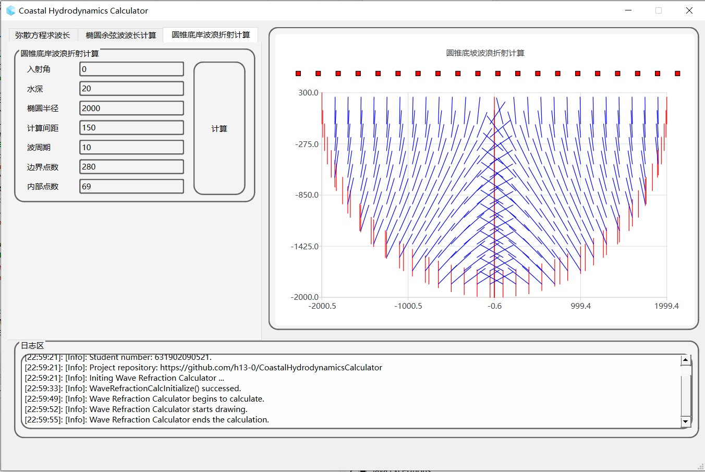

# CoastalHydrodynamicsCalculator  
海岸动力学数值计算器  

## Author  
h13, ID:631902090521  
港越1902, 学号: 631902090521.  

## Dependencies.  
> Qt6  
> Qt Charts  

## 弥散方程计算

## 椭圆余弦波遍历计算

## 圆锥底岸波浪折射计算
### MATLAB验证

### C++调用MATLAB的dll计算

